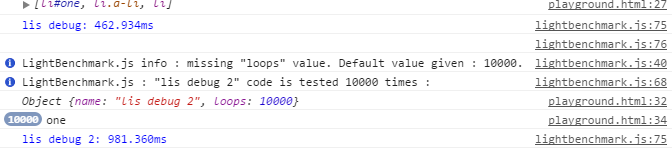

# LightTimer.js

A **simple** and lightweight **timer in native JavaScript**. Useful for **benchmarks**.




### Usage

LightTimer.js is written in native JavaScript, so it **doesn't need any dependency**.
Just include [lighttimer.js](lighttimer.js) or [lighttimer.min.js](lighttimer.min.js) in `<head></head>` **or just before** `</body>` (**recommended**).

```html
  <script src="/your-custom-path/lighttimer.min.js"></script>
  <script src="/another-path/your-script.js"></script>
</body>
```


Then, you can call the **lighttimer function** in different ways.

The **most complete and useful way** is :

```javascript
var options = {name: 'name of the timer', loops: 'default'};
lighttimer(options, function (ltIncrement, ltOptions) {
  // Your instructions.
});
```

`name` must be a `string`. Default value : `'Default'`.

`loops` must be a `integer` or a **predefined value** :

* `'low'` : `1000` loops.
* `'default'` : `10000` loops. **Default value**.
* `'high'` : `100000` loops.

You don't necessarily have to specify `name` or `loops`, but they will be **replaced by default values**.


You can also access some **additional datas** by specify them as **arguments** of the function you give to lighttimer(). **You can give them the names you want** :

```javascript
lighttimer({}, function (ltIncrement, ltOptions) {});
```

* `ltIncrement` : increment variable.
* `ltOptions` : options you gave, composed of `ltOptions.name` and `ltOptions.loops`.


So, the **minimal way** to call lighttimer() is :

```javascript
lighttimer({}, function () {
  // Your instructions.
});
```


### Notes

* More the `loops` value is **high**, more the results will be **precise and accurate**.

* **The execution time may vary** depending on the **computer** and the **browser** used.

* If you like LightTimer.js, please  this repository so it can **easily be found** and **help other developers**.

**Thank you !** :wink:


### License
LightTimer.js is released under the [MIT License](LICENSE).
